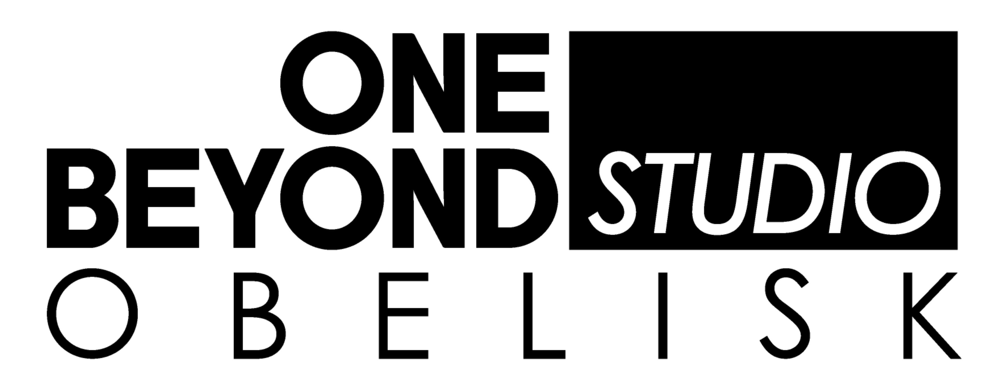

  

# One Beyond Studio SignalR

A quick SignalR implementation. This is designd for use with Obelisk and Azure SignalR Service.

## Usage
- Add the nuget package to any part of the application that will use SignalR. This usually includes at least the Web App and Workers. Some Domain/Application may also which to use it.
- Any entrypoint that will run SignalR must run `RegisterSignalR` from an `IServiceCollection`.
- Specify `AzureSignalRConnectionString` as an app setting. When deployed this should be from a Key Vault App Setting.
- In order to authenticate, the FE needs an endpoint that calls the `NegotiateAsync` function. This will allow it to receive messages.
- The backend uses the management API, so does not need to negotiate.
- There are some helpful functions to send a default error `PublishErrorMessageAsync`, and send arbitrary json to a specific user `PublishAsync<TMessageDto>`.
- For more complex situations, please use `GetHubContextAsync` to get the full set of controls.
